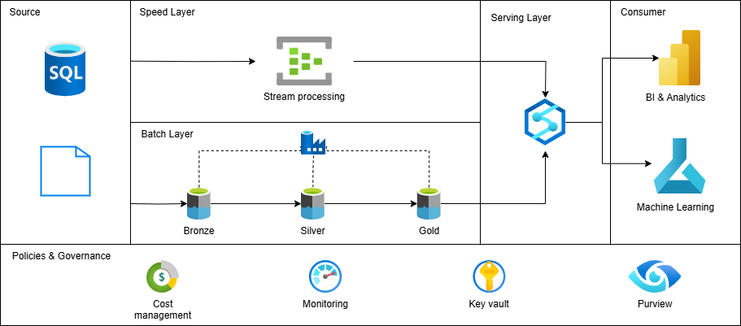

# Show Data Project

Data engineering project

## Project checklist

## Architecture
#### Arquitetura lambda

A arquitetura lambda é um estilo de design de sistemas de processamento de dados que visa proporcionar uma solução robusta e eficiente para processar grandes volumes de dados em tempo real e em lote.

Ela foi criada para lidar com os desafios de (Big Data) e combina duas camadas principais de processamento: a batch layer e a speed layer. Além disso, há a serving layer que une os resultados dessas duas camadas para fornecer respostas rápidas às consultas.

#### Batch layer
A batch layer é uma dos componantes de uma arquitetura lambda, usada para processar grandes volumes de dados em intervalos regulares, realizando processamento em lote para gerar visões completas e precisas dos dados ao longo do tempo.

- Vantagens

    - Precisão dos Dados: O processamento em lote garante que todas as entradas de dados sejam consideradas, resultando em agregações e análises precisas.

    - Histórico Completo: Mantém um registro completo e imutável dos dados, permitindo reprocessamento e análises históricas.

 - Desvantagens

    - Latência: Não é adequada para necessidades de processamento em tempo real, pois há um atraso inerente ao processamento em lote.

    - Recursos Computacionais: Pode exigir uma grande quantidade de recursos computacionais, especialmente para grandes volumes de dados.

#### Speed layer

A speed layer é uma parte crucial da arquitetura Lambda, projetada para processar dados em tempo real. Enquanto a batch layer lida com grandes volumes de dados de forma não urgente, a speed layer garante que os dados recentes sejam processados e disponibilizados quase instantaneamente. Isso permite que o sistema responda rapidamente a eventos e consultas.

- Vantagens
    - Processamento de Dados em Tempo Real: A função principal da speed layer é processar os dados em tempo real, ou seja, assim que os dados chegam, eles são imediatamente analisados e transformados. Isso permite que as informações mais recentes sejam rapidamente integradas ao sistema.

    - Atualizações Incrementais: Enquanto a batch layer processa grandes volumes de dados em lote, a speed layer faz atualizações incrementais, processando apenas os dados novos ou modificados desde a última execução. Isso reduz a quantidade de dados a ser processada e melhora a eficiência.

- Desvantagens
    - Complexidade de Implementação: Requer configuração e gerenciamento cuidadosos para garantir desempenho e confiabilidade.

    - Escalabilidade: Pode enfrentar desafios de escalabilidade dependendo do volume de dados e da carga de trabalho.

    - Custo

### Conceptual Architecture

### Architecture Stack

