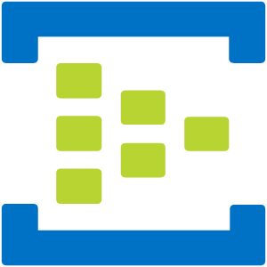

# Show Data Project
A violência contra a mulher é um problema grave que afeta diretamente a saúde, segurança e direitos das mulheres. Analisando os dados de violência ao longo dos anos, podemos identificar tendências, padrões e áreas de maior risco, o que é fundamental para desenvolver políticas públicas eficazes e campanhas de conscientização.

## Objetivo 
Criar um MVP que possa ingerir dados públicos de violência contra a mulher no Estado de Minas Gerais, processá-los através das camadas de dados Bronze, Silver e Gold usando o Azure Data Factory para transformar esses dados e gerar insights valiosos para a formulação de políticas públicas e como a violência contra a mulher mudou ao longo dos anos. 

## Atividades técnicas para o MVP

1. Verificação dos arquivos brutos;
2. Levantamento de requisitos;
3. Definição e desenho da arquitetura;
4. Preparação do ambiente;
5. Desenvolvimento;
6. Teste e validação.

## Project checklist

## Architecture
### Conceptual Architecture

### Arquitetura lambda

A arquitetura lambda é um estilo de design de sistemas de processamento de dados que visa proporcionar uma solução robusta e eficiente para processar grandes volumes de dados em tempo real e em lote.

Ela foi criada para lidar com os desafios de Big Data e combina duas camadas principais de processamento: a batch layer e a speed layer. Além disso, há a serving layer que une os resultados dessas duas camadas para fornecer respostas rápidas às consultas.

---

#### Batch layer
A batch layer é uma dos componantes de uma arquitetura lambda, usada para processar grandes volumes de dados em intervalos regulares, realizando processamento em lote para gerar visões completas e precisas dos dados ao longo do tempo.

- Vantagens

    - Precisão dos Dados: O processamento em lote garante que todas as entradas de dados sejam consideradas, resultando em agregações e análises precisas.

    - Histórico Completo: Mantém um registro completo e imutável dos dados, permitindo reprocessamento e análises históricas.

 - Desvantagens

    - Latência: Não é adequada para necessidades de processamento em tempo real, pois há um atraso inerente ao processamento em lote.

    - Recursos Computacionais: Pode exigir uma grande quantidade de recursos computacionais, especialmente para grandes volumes de dados.

---

#### Speed layer

A speed layer é uma parte crucial da arquitetura Lambda, projetada para processar dados em tempo real. Enquanto a batch layer lida com grandes volumes de dados de forma não urgente, a speed layer garante que os dados recentes sejam processados e disponibilizados quase instantaneamente. Isso permite que o sistema responda rapidamente a eventos e consultas.

- Vantagens
    - Processamento de Dados em Tempo Real: A função principal da speed layer é processar os dados em tempo real, ou seja, assim que os dados chegam, eles são imediatamente analisados e transformados. Isso permite que as informações mais recentes sejam rapidamente integradas ao sistema.

    - Atualizações Incrementais: Enquanto a batch layer processa grandes volumes de dados em lote, a speed layer faz atualizações incrementais, processando apenas os dados novos ou modificados desde a última execução. Isso reduz a quantidade de dados a ser processada e melhora a eficiência.

- Desvantagens
    - Complexidade de Implementação: Requer configuração e gerenciamento cuidadosos para garantir desempenho e confiabilidade.

    - Escalabilidade: Pode enfrentar desafios de escalabilidade dependendo do volume de dados e da carga de trabalho.

    - Custo

---
---

### Architecture Stack

### Soluções utilizadas
---
---

- **Azure Event Hubs**: Plataforma de streaming de dados em tempo real que pode transmitir milhões de eventos por segundo com baixa latência. Compatível com Apache Kafka.

    - Benefícios:
        - Escalabilidade: Suporta o processamento de grandes volumes de dados em tempo real.

        - Baixa Latência: Permite a ingestão de dados com latência mínima, essencial para aplicações críticas.

---

- **Azure Data Lake Storage**: Solução de armazenamento de dados em nuvem projetada para grandes quantidades de dados estruturados e não estruturados, facilitando análises de Big Data.

    - Benefícios:
        - Economia: Armazenamento econômico para grandes volumes de dados.
        - Integração Simples: Fácil integração com outras ferramentas de Big Data, como Hadoop e Spark.

---

- **Azure Synapse Analytics**: Plataforma de análise integrada que combina data warehousing e análise de Big Data, permitindo análises avançadas e insights em tempo real.

    - Benefícios:
        - Análise Unificada: Combina processamento de dados e análises em uma única plataforma.
        - Desempenho: Alta performance para consultas complexas e análises de dados.

---

- **Azure Data Factory**: Serviço de integração de dados que automatiza e orquestra processos de ETL (Extração, Transformação, Carregamento) e integração de dados entre diferentes fontes.

    - Benefícios:
        - Automatização: Facilita a automação de fluxos de trabalho de dados.
        - Conectividade: Suporta a integração com uma ampla variedade de fontes e destinos de dados.

---

- **Microsoft Power BI**: Ferramenta de visualização de dados que permite criar dashboards interativos e relatórios para ajudar na tomada de decisões com base em dados.

    - Benefícios:
        - Interatividade: Dashboards interativos que facilitam a exploração de dados.
        - Acessibilidade: Acesso fácil a partir de qualquer dispositivo, promovendo a tomada de decisões baseada em dados.

---

- **Azure ML**: Plataforma de machine learning que facilita a criação, treinamento e implantação de modelos de machine learning.

    - Benefícios:
        - Automação de ML: Automatiza partes do processo de machine learning, como feature engineering e seleção de modelos.
        - Implantação Simplificada: Facilita a implantação de modelos em produção com poucos cliques.

---

- **Azure Key Vault**: Serviço de gerenciamento de segredos que armazena e controla o acesso a senhas, certificados, chaves de criptografia e outros segredos.

    - Benefícios:
        - Segurança: Protege dados sensíveis com segurança robusta.
        - Gerenciamento Centralizado: Oferece um local central para gerenciar chaves e segredos, simplificando a conformidade e segurança.

---

- **Azure Purview**: Serviço de governança de dados que ajuda a descobrir, entender e gerenciar dados em toda a organização, garantindo conformidade e segurança.

    - Benefícios:
        - Descoberta de Dados: Facilita a descoberta e catalogação de dados em toda a organização.
        - Governança e Conformidade: Ajuda a garantir que os dados estão em conformidade com regulamentos e políticas internas.

---

- **Azure Cost Management**: Conjunto de ferramentas que ajudam as organizações a analisar, monitorar e otimizar os custos com o Microsoft Cloud. Oferece relatórios detalhados e alertas para ajudar a controlar os gastos.

    - Benefícios:
        - Controle de custos: Ajuda a definir orçamentos, monitorar anomalias de custo e prever despesas futuras.
        - Otimização de recursos: Permite a alocação de custos entre diferentes unidades de negócios, projetos ou clientes, promovendo eficiência e responsabilidade.

---

- **Azure Monitor** : Solução de monitoramento que coleta, analisa e responde a dados de monitoramento de ambientes de nuvem e locais. Ajuda a maximizar a disponibilidade e o desempenho dos aplicativos e serviços.

    - Benefícios:
        - Visibilidade completa: Monitora recursos em várias camadas e componentes, fornecendo uma visão abrangente do desempenho do sistema.
        - Resposta proativa: Permite respostas manuais e programáticas a eventos do sistema, ajudando a identificar e resolver problemas rapidamente.

---
---

### Camadas de Dados Batch
1. **Bronze Layer (Camada Bronze)**
    - **Objetivo**: Armazenar os dados brutos exatamente como foram ingeridos.

    - **Processo**:
        - Azure Data Factory copia os dados da fonte para o Azure Data Lake Storage na camada Bronze.
        - Nenhuma transformação significativa é nesta etapa.

2. **Silver Layer (Camada Prata)**
    - **Objetivo**: Limpeza e pré-processamento dos dados.

    - **Processo**:
        - Azure Data Factory executa pipelines de limpeza e transformação dos dados brutos.

        - Remoção de duplicatas, tratamento de valores nulos e padronização dos formatos de dados.

        - Armazenamento dos dados processados no Azure Data Lake Storage na camada Silver.

3. **Gold Layer (Camada Ouro)**
    - **Objetivo**: Dados preparados para análise e modelagem.

    - **Processo**:
        - Azure Data Factory realiza transformações avançadas, agregações e cálculos necessários.

        - Dados são otimizados para consultas rápidas e análises.

        - Armazenamento dos dados finalizados no Azure Data Lake Storage na camada Gold.

