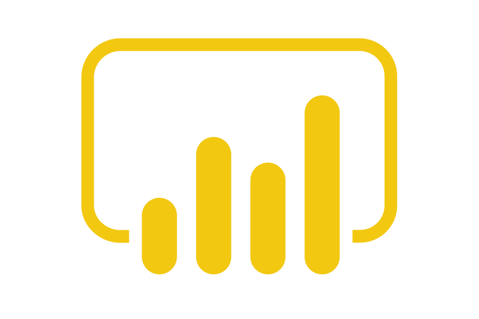
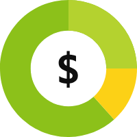

# Hands-on Engenharia de Dados Mackenzie

### Integrantes

|Nome                              |                          
|---------------------------       |
|Henrique Guilherme - RA: 10444658 |
|Mônica Dyna - RA: 10444608        |
|Renato Mori - RA: 10444622        |
|Vinícius Soares - RA: 10444899    |

# Visão Geral

### Show Data Project
A violência contra a mulher é um problema grave que afeta diretamente a saúde, segurança e direitos das mulheres. Analisando os dados de violência ao longo dos anos, podemos identificar tendências, padrões e áreas de maior risco, o que é fundamental para desenvolver políticas públicas eficazes e campanhas de conscientização.

### Objetivo 
Criar um MVP que possa mostrar dados públicos de violência contra a mulher no Estado de Minas Gerais, processá-los através das camadas de dados Bronze, Silver e Gold usando o Azure Data Factory para transformar esses dados e gerar insights valiosos para a formulação de políticas públicas e dar visibilidade à violência contra a mulher ao longo dos anos. 

O dataset utilizado foi extraído do site do Governo Federal brasileiro contendo o histórico dos últimos 10 anos (2014-2023) de incidentes de violência contra a mulher no Estado de Minas Gerais.

## Atividades técnicas para o MVP

1. Verificação dos arquivos brutos;
2. Levantamento de requisitos;
3. Definição e desenho da arquitetura;
4. Preparação do ambiente;
5. Desenvolvimento;
6. Teste e validação.

## [Checklist](https://github.com/orgs/Show-Instituto-de-Pesquisa/projects/1/views/1) 

## Requisitos
- Sistema resiliente;
- Deve suportar ingestão de dados em batch e em streaming;
- As camadas de dados devem manter rastreabilidade e serem isoladas umas das outras;
- O projeto não deve ultrapassar X reais de custo com ferramentas;
- Deve-se ter uma camada de governança de custos, dados sensíveis e linhagem de dados;
- O projeto deve suportar o consumo de dados para Analytics.

# Arquitetura

### Conceito Lambda

### O que é a arquitetura Lambda?
É um estilo de design de sistemas de processamento de dados que visa proporcionar uma solução robusta e eficiente para processar grandes volumes de dados em tempo real e em lote.

Ela foi criada para lidar com os desafios de Big Data e combina duas camadas principais de processamento: a `batch layer` e a `speed layer`. Além disso, há a serving layer que une os resultados dessas duas camadas para fornecer respostas rápidas às consultas.

---

### `Batch layer`
A batch layer é um dos componentes de uma arquitetura lambda, usada para processar grandes volumes de dados em intervalos regulares, realizando processamento em lote para gerar visões completas e precisas dos dados ao longo do tempo.

- Vantagens

    - Precisão dos Dados: O processamento em lote garante que todas as entradas de dados sejam consideradas, resultando em agregações e análises precisas.

    - Histórico Completo: Mantém um registro completo e imutável dos dados, permitindo reprocessamento e análises históricas.

 - Desvantagens

    - Latência: Não é adequada para necessidades de processamento em tempo real, pois há um atraso inerente ao processamento em lote.

    - Recursos Computacionais: Pode exigir uma grande quantidade de recursos computacionais, especialmente para grandes volumes de dados.

---

### `Speed layer`

A speed layer é uma parte crucial da arquitetura Lambda, projetada para processar dados em tempo real. Enquanto a batch layer lida com grandes volumes de dados de forma não urgente, a speed layer garante que os dados recentes sejam processados e disponibilizados quase instantaneamente. Isso permite que o sistema responda rapidamente a eventos e consultas.

- Vantagens
    - Processamento de Dados em Tempo Real: A função principal da speed layer é processar os dados em tempo real, ou seja, assim que os dados chegam, eles são imediatamente analisados e transformados. Isso permite que as informações mais recentes sejam rapidamente integradas ao sistema.

    - Atualizações Incrementais: Enquanto a batch layer processa grandes volumes de dados em lote, a speed layer faz atualizações incrementais, processando apenas os dados novos ou modificados desde a última execução. Isso reduz a quantidade de dados a ser processada e melhora a eficiência.

- Desvantagens
    - Complexidade de Implementação: Requer configuração e gerenciamento cuidadosos para garantir desempenho e confiabilidade.

    - Escalabilidade: Pode enfrentar desafios de escalabilidade dependendo do volume de dados e da carga de trabalho.

    - Custo: Se não for bem implementada, a arquitetura Lambda pode introduzir latências indesejadas em alguns casos de uso, o que pode não ser aceitável para certos negócios e pode requerer investimentos adicionais para otimização.

---

### Plataformas e soluções (Azure)

---

### Pipeline e tratamento de dados

---
### `Cidades com maior número de incidentes`

### `Principais tipos de incidentes`

---

**Azure Event Hubs**: Plataforma de streaming de dados em tempo real que pode transmitir milhões de eventos por segundo com baixa latência. Compatível com Apache Kafka.

---

**Azure Data Lake Storage**: Solução de armazenamento de dados em nuvem projetada para grandes quantidades de dados estruturados e não estruturados, facilitando análises de Big Data.

---

**Azure Synapse Analytics**: Plataforma de análise integrada que combina data warehousing e análise de Big Data, permitindo análises avançadas e insights em tempo real.

---

**Azure Data Factory**: Serviço de integração de dados que automatiza e orquestra processos de ETL (Extração, Transformação, Carregamento) e integração de dados entre diferentes fontes.

---

**Microsoft Power BI**: Ferramenta de visualização de dados que permite criar dashboards interativos e relatórios para ajudar na tomada de decisões com base em dados.

---

**Azure ML**: Plataforma de machine learning que facilita a criação, treinamento e implantação de modelos de machine learning.

---

**Azure Key Vault**: Serviço de gerenciamento de segredos que armazena e controla o acesso a senhas, certificados, chaves de criptografia e outros segredos.

---

**Azure Purview**: Serviço de governança de dados que ajuda a descobrir, entender e gerenciar dados em toda a organização, garantindo conformidade e segurança.

---

**Azure Cost Management**: Conjunto de ferramentas que ajudam as organizações a analisar, monitorar e otimizar os custos com o Microsoft Cloud. Oferece relatórios detalhados e alertas para ajudar a controlar os gastos.

---

**Azure Monitor** : Solução de monitoramento que coleta, analisa e responde a dados de monitoramento de ambientes de nuvem e locais. Ajuda a maximizar a disponibilidade e o desempenho dos aplicativos e serviços.

## Calculadora de custos

## Insights e conclusão

### Insights
**Distribuição Geográfica da Violência**

- Belo Horizonte tem o maior número de registros (42), mostrando ser o município com mais ocorrências.
- Juiz de Fora (19), Montes Claros (18) e Teófilo Otoni (16) também têm números significativos, indicando concentração de violência em centros urbanos.
- Municípios menores como Patos de Minas (10) e Manhuaçu (11) ainda mostram números expressivos, sugerindo que a violência não está restrita às capitais. 

**Natureza dos Delitos**

- Ameaça é o delito mais comum, com 311 casos, mostrando predominância da violência psicológica/intimidatória.
- Vias de fato/agressão (243 casos) e lesão corporal (165 casos) são frequentes, revelando alta prevalência de violência física.
- Dano (26 casos) e outras infrações (28 casos) têm valores menores, mas contribuem para o quadro geral da violência.
- Atrito verbal e descumprimento (16-18 casos) sugerem conflitos verbais ou desobediência a ordens legais, como medidas protetivas.

 **Correlação Possível**

- Municípios mais populosos, como Belo Horizonte, tendem a ter mais casos de violência.
- A predominância de ameaças e agressões pode indicar que a violência contra a mulher frequentemente começa com intimidações verbais e escala para agressões físicas.

## Conclusões
  
**Foco em Prevenção e Políticas Públicas**
- Intensificar políticas públicas em municípios como Belo Horizonte, Juiz de Fora e Montes Claros, que têm altos registros.
- Implementar programas de conscientização e campanhas de educação sobre violência doméstica, focando em ameaças e agressões físicas.
    
**Atenção às Naturezas de Delito**
- Delitos como ameaça e lesão corporal requerem maior vigilância e punições mais eficazes para reduzir a reincidência.
- Criar sistemas de denúncia mais rápidos e acessíveis para mitigar ameaças antes que evoluam para agressões físicas mais graves.
    
### Conclusões Técnicas
  
**Uso de Dados para Monitoramento Contínuo**
- A camada Gold pode gerar dashboards que correlacionam as informações geográficas com os tipos de delitos, permitindo identificar padrões sazonais, locais críticos e tipos de agressões predominantes.
- Insights adicionais podem ser gerados através do machine learning com dados complementares, como idade das vítimas, reincidência dos agressores e eficiência das medidas protetivas.

### Dificuldades, lições aprendidas e melhorias

- Criação de Storage Accounts para cada camada (bronze, silver e gold) de forma a manter um insolamento melhor dos dados e facilitar o gerenciamento de acessos e permissões.
- Adicionar uma camada Delta ou Iceberg em cima dos arquivos .parquet para garantir ACID.
- Realizar um fine tuning das configurações dos recursos utilizados a fim de melhorar o gerenciamento de custos.
- Dificuldades de horário e organização entre membros para realização de reuniões.
- Dificuldades sobre permissões e acessos da Azure.
