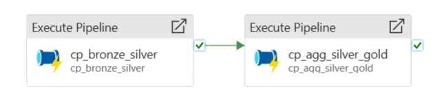
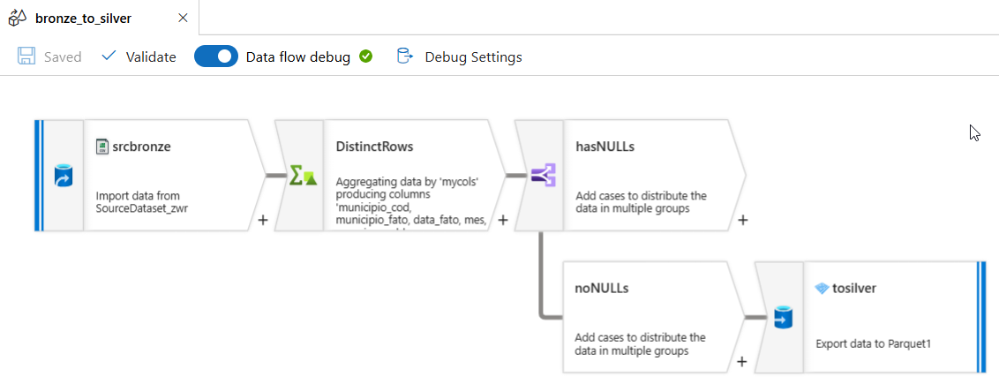
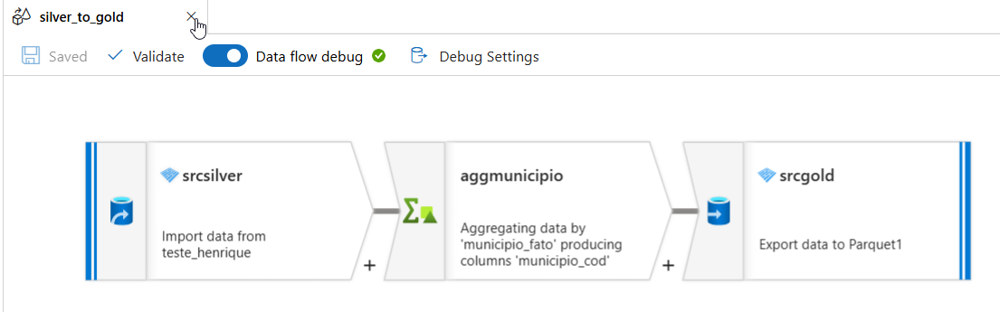

# Hands-on Engenharia de Dados Mackenzie
### Integrantes

|Nome               |RA         |                          
|---                |---        |
|Henrique Guilherme |10444658   |
|Mônica Dyna        |10444608   |
|Renato Mori        |10444622   |
|Vinícius Soares    |10444899   |

# Visão Geral

### Show Data Project
A violência contra a mulher é um problema grave que afeta diretamente a saúde, segurança e direitos das mulheres. Analisando os dados de violência ao longo dos anos, podemos identificar tendências, padrões e áreas de maior risco, o que é fundamental para desenvolver políticas públicas eficazes e campanhas de conscientização.

O dataset utilizado para este trabalho foi extraído do site do Governo Federal brasileiro contendo o histórico dos últimos 10 anos (2014-2023) de incidentes de violência contra a mulher no Estado de Minas Gerais.

## Objetivo 

- Desenvolver um MVP que:

    - Ingere dados públicos de violência contra a mulher no Estado de Minas Gerais.
    - Processa os dados em camadas de dados: Bronze, Silver e Gold.
    - Utiliza o Azure Data Factory para transformar e armazenar os dados.
    - Gera insights valiosos para apoiar políticas públicas e monitorar a evolução dos índices de violência ao longo dos anos.

## Atividades técnicas para o MVP

1. Verificação dos arquivos brutos
2. Levantamento de requisitos
3. Definição e desenho da arquitetura
4. Preparação do ambiente
5. Desenvolvimento
6. Teste e validação

## Requisitos do Projeto

- Resiliência do sistema.
- Suporte à ingestão de dados em batch e streaming.
- Manutenção da rastreabilidade e isolamento entre camadas de dados.
- Controle de custos, com um limite pré-estabelecido.
- Implementação de governança de dados, custos e dados sensíveis.
- Suporte ao consumo de dados para Analytics.

## [Checklist de acompanhamento](https://github.com/orgs/Show-Instituto-de-Pesquisa/projects/1/views/1)

# Arquitetura
### Conceito da Arquitetura Lambda

A arquitetura Lambda é uma abordagem híbrida para processamento de grandes volumes de dados, combinando processamento em lote (batch layer) e tempo real (speed layer).

### Arquitetura Lambda

### `Batch Layer`:

A batch layer é um dos componentes de uma arquitetura lambda, usada para processar grandes volumes de dados em intervalos regulares, realizando processamento em lote para gerar visões completas e precisas dos dados ao longo do tempo.

- Vantagens:
    - `Precisão`: O processamento em lote garante que todas as entradas de dados sejam consideradas, resultando em agregações e análises precisas.
    - `Histórico Completo`: Mantém um registro completo e imutável dos dados, permitindo reprocessamento e análises históricas.
- Desvantagens:
    - `Latência`: Não é adequada para necessidades de processamento em tempo real, pois há um atraso inerente ao processamento em lote.
    - `Recursos Computacionais`: Pode exigir uma grande quantidade de recursos computacionais, especialmente para grandes volumes de dados.
### `Speed Layer`: 
- A speed layer é uma parte crucial da arquitetura Lambda, projetada para processar dados em tempo real. Enquanto a batch layer lida com grandes volumes de dados de forma não urgente, a speed layer garante que os dados recentes sejam processados e disponibilizados quase instantaneamente. Isso permite que o sistema responda rapidamente a eventos e consultas.
    
- Vantagens:
    - `Processamento de Dados em Tempo Real`: A função principal da speed layer é processar os dados em tempo real, ou seja, assim que os dados chegam, eles são imediatamente analisados e transformados. Isso permite que as informações mais recentes sejam rapidamente integradas ao sistema.
    - `Atualizações Incrementais`: Enquanto a batch layer processa grandes volumes de dados em lote, a speed layer faz atualizações incrementais, processando apenas os dados novos ou modificados desde a última execução. Isso reduz a quantidade de dados a ser processada e melhora a eficiência.
- Desvantagens:
    - `Complexidade de Implementação`: Requer configuração e gerenciamento cuidadosos para garantir desempenho e confiabilidade.
    - `Escalabilidade`: Pode enfrentar desafios de escalabilidade dependendo do volume de dados e da carga de trabalho.
    - `Custo`: Se não for bem implementada, a arquitetura Lambda pode introduzir latências indesejadas em alguns casos de uso, o que pode não ser aceitável para certos negócios e pode requerer investimentos adicionais para otimização.

## Plataformas e Ferramentas Utilizadas

A solução utiliza a stack Azure para garantir escalabilidade, desempenho e segurança.

|Logo                                                                                   |Ferramenta             |Descrição                                                              |
|---                                                                                    |---                    |---                                                                    |
|                          |Azure Event Hubs       |Plataforma de streaming para ingestão de dados em tempo real.          |
|                           |Azure Data Lake        |Armazenamento escalável para dados estruturados e não estruturados.    |
|                        |Azure Data Factory     |Orquestra ETL/ELT para integração e transformação de dados.            |
|                       |Azure Synapse          |Realiza análises avançadas e armazena dados otimizados.                |
|                            |Power BI               |Visualização de dados com dashboards interativos.                      |
|                            |Azure ML               |Plataforma para criação e implantação de modelos de Machine Learning.  |
|                            |Azure Key Vault        |Gerenciamento seguro de segredos e credenciais.                        |
|                       |Azure Purview          |Governança e rastreabilidade de dados.                                 |
|                       |Azure Monitor          |Monitoramento contínuo dos serviços.                                   |
|                          |Azure Cost Management  |Gestão e otimização dos custos.                                        |    

## Pipeline de Dados
### Fluxo de dados através das camadas:

### `Ingestão (Bronze Layer)`:
- Dados brutos são armazenados no Azure Data Lake.
- Dados em tempo real chegam pelo Azure Event Hubs.

### `Transformação (Silver Layer)`:
- Processamento de dados através do Azure Data Factory.
- Limpeza, tratamento e transformação para dados estruturados.

### `Otimização (Gold Layer)`:
- Dados refinados e agregados são armazenados no Synapse Analytics.
- Dados prontos para consumo no Power BI.

## Representação do Pipeline

### Pipeline Azure Data Factory:

### Dataflow Bronze to Silver:

### Dataflow Silver to Gold:

### Dados Agregados:

#### Cidade

#### Natureza do Delito

# Benefícios da Arquitetura Implementada

1. `Pipeline Unificado`: Suporte a dados em batch e streaming.
2. `Escalabilidade Horizontal`: Processamento eficiente para grandes volumes.
3. `Segurança`: Implementação do Azure Key Vault e Purview.
4. `Insights Analíticos e Preditivos`:
    - Machine Learning com Azure ML.
    - Visualizações com Power BI.
5. `Custo Controlado`: Otimização com Azure Cost Management.
6. `Monitoramento Contínuo`: Garantido pelo Azure Monitor.

# Desvantagens Possíveis

1. `Complexidade de Implementação: Requer configuração e gerenciamento cuidadosos para garantir desempenho e confiabilidade.
2. `Escalabilidade: Pode enfrentar desafios de escalabilidade dependendo do volume de dados e da carga de trabalho.
3. `Custo: Se não for bem implementada, a arquitetura Lambda pode introduzir latências indesejadas em alguns casos de uso, o que pode não ser aceitável para certos negócios e pode requerer investimentos adicionais para otimização.

# Calculadora de Custos

Região dos recursos:

- East US 
- East US 2

Categoria dos serviços:

- Banco de Dados
- Armazenamento
- Análises
- Segurança

Custo mensal por categoria:

- Banco de dados: `$463,75`
- Armazenamento: `$50,64`
- Análises: `$779,15`
- Segurança: `$5,03`

Custo por recurso:
- Azure Synapse Analytics: `$463,75`
- Storage Accounts: `$50,64`
- Event Hubs: `$11,23`
- Azure Machine Learning: `$151,87`
- Microsoft Purview: `$246,79`
- Key Vault: `$5,03`
- Azure Data Factory: `$369,25`

Custo Total Mensal:

### `$1.298,56`

#### (Todos os valores apresentados estão em dólares americanos (US$) )
#### (Os valores são estimados e podem sofrer variação. Para obter informações atualizadas sobre preços, visite https://azure.microsoft.com/pricing/calculator/)

# Insights e Conclusões
### Insights
**Distribuição Geográfica da Violência**

- Belo Horizonte tem o maior número de registros (42), mostrando ser o município com mais ocorrências.
- Juiz de Fora (19), Montes Claros (18) e Teófilo Otoni (16) também têm números significativos, indicando concentração de violência em centros urbanos.
- Municípios menores como Patos de Minas (10) e Manhuaçu (11) ainda mostram números expressivos, sugerindo que a violência não está restrita às capitais. 

**Natureza dos Delitos**

- Ameaça é o delito mais comum, com 311 casos, mostrando predominância da violência psicológica/intimidatória.
- Vias de fato/agressão (243 casos) e lesão corporal (165 casos) são frequentes, revelando alta prevalência de violência física.
- Dano (26 casos) e outras infrações (28 casos) têm valores menores, mas contribuem para o quadro geral da violência.
- Atrito verbal e descumprimento (16-18 casos) sugerem conflitos verbais ou desobediência a ordens legais, como medidas protetivas.

 **Correlação Possível**

- Municípios mais populosos, como Belo Horizonte, tendem a ter mais casos de violência.
- A predominância de ameaças e agressões pode indicar que a violência contra a mulher frequentemente começa com intimidações verbais e escala para agressões físicas.

## Conclusões
  
**Foco em Prevenção e Políticas Públicas**
- Intensificar políticas públicas em municípios como Belo Horizonte, Juiz de Fora e Montes Claros, que têm altos registros.
- Implementar programas de conscientização e campanhas de educação sobre violência doméstica, focando em ameaças e agressões físicas.
    
**Atenção às Naturezas de Delito**
- Delitos como ameaça e lesão corporal requerem maior vigilância e punições mais eficazes para reduzir a reincidência.
- Criar sistemas de denúncia mais rápidos e acessíveis para mitigar ameaças antes que evoluam para agressões físicas mais graves.
    
### Conclusões Técnicas
  
**Uso de Dados para Monitoramento Contínuo**
- A camada Gold pode gerar dashboards que correlacionam as informações geográficas com os tipos de delitos, permitindo identificar padrões sazonais, locais críticos e tipos de agressões predominantes.
- Insights adicionais podem ser gerados através do machine learning com dados complementares, como idade das vítimas, reincidência dos agressores e eficiência das medidas protetivas.

### Dificuldades, lições aprendidas e melhorias

- Criação de Storage Accounts para cada camada (bronze, silver e gold) de forma a manter um insolamento melhor dos dados e facilitar o gerenciamento de acessos e permissões.
- Adicionar uma camada Delta ou Iceberg em cima dos arquivos .parquet para garantir ACID.
- Realizar um fine tuning das configurações dos recursos utilizados a fim de melhorar o gerenciamento de custos.
- Dificuldades de horário e organização entre membros para realização de reuniões.
- Dificuldades sobre permissões e acessos da Azure não concedidos em tempo hábil.
